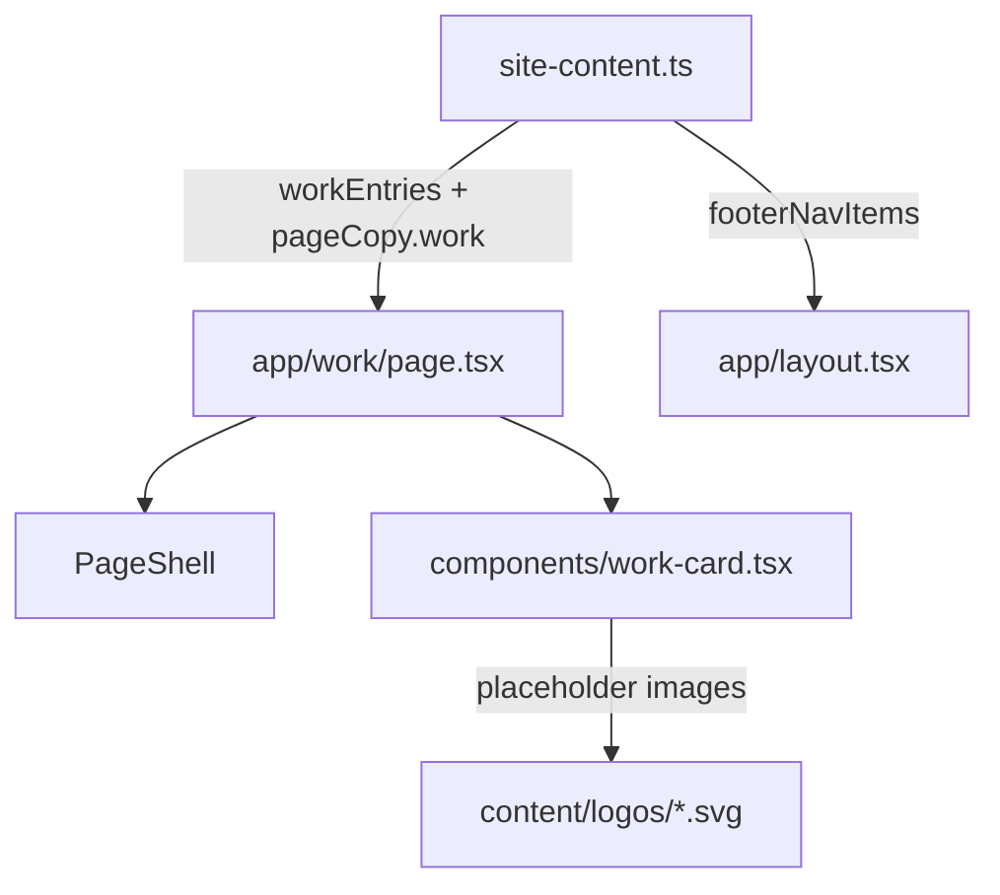

# Create /work Page with Client Project Cards

## Architecture

The implementation follows the existing patterns: content data in `site-content.ts`, a dedicated card component, and a page that uses `PageShell`.



## 1. Content data in [site-content.ts](content/site-content.ts)

- Add a `WorkEntry` type:

```typescript
export type WorkEntry = {
  client: string;
  url: string;
  description: string;
  techStack: string[];
  logo: StaticImageData;
};
```

- Add `workEntries: WorkEntry[]` array with all 5 clients and their provided descriptions.
- Add `pageCopy.work` with title (`"Work"`) and `metaDescription`.
- Insert `{ href: "/work", label: "Work" }` **before** the `/play` entry in `footerNavItems`.

## 2. Placeholder logo images in `content/logos/`

Create simple SVG placeholder files for each client (Levi's, Harrods, Fielmann, TenneT, fussball.de) -- minimal branded-colored rectangles with the client name centered. These follow the same `content/` asset convention as album covers. Since SVGs can't use `StaticImageData` with `placeholder="blur"`, the type will use `string` for `logo` and standard `` or Next.js `Image` with remote/local path instead. Alternatively, use a simple colored `<div>` placeholder with the client name -- this is cleaner for temporary placeholders.

**Decision:** Use a simple colored `<div>` as the placeholder (no image files needed for now). The `WorkEntry` type will include an optional `logo` field so real images can be added later. For now, cards show a styled color block with the client initial.

## 3. `WorkCard` component in [components/work-card.tsx](components/work-card.tsx)

A card inspired by `MusicCard` but adapted for project work:

**Default state (visible):**

- Colored placeholder block (aspect-3/2 or aspect-video) with client initial/name
- Client name as heading
- Tech stack as small inline pills/tags

**Hover animation -- "curtain reveal":**

- On hover, a semi-transparent overlay slides up from the bottom (using `translate-y` + opacity transition)
- The overlay contains the description text with a subtle backdrop-blur
- Uses the project's existing easing (`ease-default`) and a `duration-normal` (300ms) transition
- Fully accessible: description also available via `aria-description` or visually-hidden text for screen readers
- Respects `prefers-reduced-motion` (tokens already zero out durations)

**Markup sketch:**

```tsx
<article className="group relative flex flex-col gap-3">
  <a href={entry.url} target="_blank" rel="noreferrer noopener">
    <div className="relative aspect-3/2 overflow-hidden rounded-sm bg-rule">
      {/* Placeholder / future image */}
      <div className="flex items-center justify-center h-full">
        <span className="font-heading text-2xl font-semibold">
          {entry.client}
        </span>
      </div>
      {/* Hover overlay with description */}
      <div
        className="absolute inset-0 flex items-end p-4
        translate-y-2 opacity-0 transition-all duration-normal ease-default
        group-hover:translate-y-0 group-hover:opacity-100
        bg-gradient-to-t from-ink/90 via-ink/70 to-transparent"
      >
        <p className="text-sm text-paper leading-relaxed">
          {entry.description}
        </p>
      </div>
    </div>
  </a>
  <div className="flex flex-col gap-1.5">
    <h2 className="font-heading text-xl font-semibold">{entry.client}</h2>
    <div className="flex flex-wrap gap-1.5">
      {entry.techStack.map((tech) => (
        <span className="text-xs text-ink-muted border border-rule rounded-full px-2 py-0.5">
          {tech}
        </span>
      ))}
    </div>
  </div>
</article>
```

## 4. Page at [app/work/page.tsx](app/work/page.tsx)

Follows the same pattern as `app/play/page.tsx`:

```tsx
export default function WorkPage() {
  return (
    <PageShell title={pageCopy.work.title}>
      <p className="text-sm text-ink-muted max-w-xl">{pageCopy.work.intro}</p>
      <div className="grid grid-cols-1 md:grid-cols-2 gap-x-6 gap-y-10">
        {workEntries.map((entry) => (
          <WorkCard key={entry.client} entry={entry} />
        ))}
      </div>
    </PageShell>
  );
}
```

No `isNarrow` on PageShell -- the cards benefit from wider layout at 2 columns.

## 5. Footer nav update in [site-content.ts](content/site-content.ts)

```typescript
export const footerNavItems: NavItem[] = [
  { href: "/work", label: "Work" },
  { href: "/play", label: "Play" },
];
```

## Files changed

- `content/site-content.ts` -- new type, data, pageCopy, footerNavItems update
- `components/work-card.tsx` -- new component (hover overlay card)
- `app/work/page.tsx` -- new page
