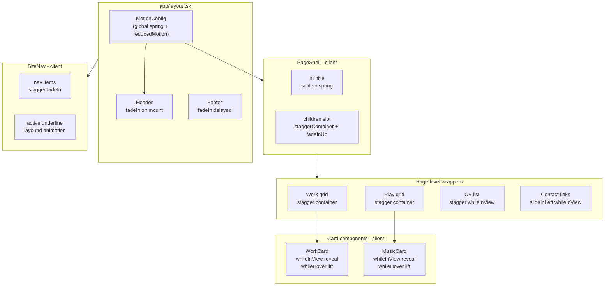

# Portfolio Animation System with Motion v12

## Design Principles

- **Expressive & playful**: spring transitions with slight bounce, noticeable staggered reveals, smooth slides
- **Consistent**: all animations use shared variants and transition config from a single source of truth
- **Accessible**: `MotionConfig` with `reducedMotion: "user"` respects user preferences alongside the existing CSS `prefers-reduced-motion` handling in [app/theme.css](app/theme.css)
- **Tailwind v4 aligned**: Tailwind handles static/responsive styles, Motion handles animation. No conflicting `transition-*` classes on Motion-animated elements
- **Clean architecture**: shared variants in a dedicated module, thin client wrappers where needed

---

## Shared Animation Tokens

New file: **[lib/motion.ts](lib/motion.ts)**

Contains all shared animation variants, transition presets, and viewport config used across the project. Single source of truth -- every component imports from here.

**Variants:**

- `fadeInUp` -- the workhorse: `{ opacity: 0, y: 20 }` to `{ opacity: 1, y: 0 }`
- `scaleIn` -- for page titles: `{ opacity: 0, scale: 0.97, y: 15 }` to `{ opacity: 1, scale: 1, y: 0 }`
- `slideInLeft` -- for contact links: `{ opacity: 0, x: -16 }` to `{ opacity: 1, x: 0 }`
- `staggerContainer` -- parent variant orchestrating children with `staggerChildren: 0.08`

**Transition presets:**

- `springDefault`: `{ type: "spring", visualDuration: 0.5, bounce: 0.15 }` -- smooth, slight bounce
- `springSnappy`: `{ type: "spring", visualDuration: 0.3, bounce: 0.25 }` -- hover interactions
- `springGentle`: `{ type: "spring", visualDuration: 0.7, bounce: 0.1 }` -- large page title

**Viewport config:**

- `viewportOnce`: `{ once: true, margin: "0px 0px -80px 0px" }` -- triggers slightly before element is fully in view

---

## CSS Spring Easings for Tailwind

Modify: **[app/theme.css](app/theme.css)**

Add CSS spring easing functions to `@theme` for CSS-only animations (the `underline-reveal` utility, color transitions on streaming icons). This keeps CSS transitions feeling aligned with Motion springs:

```css
--ease-spring: linear(
  0,
  0.0942,
  0.2989,
  0.5275,
  0.73,
  0.8839,
  0.9858,
  1.0425,
  1.0655,
  1.0666,
  1.0558,
  1.0405,
  1.0255,
  1.0131,
  1.0043,
  0.9989,
  0.9962,
  1
);
```

Update `underline-reveal` in [app/utilities.css](app/utilities.css) to use `--ease-spring` instead of `--ease-default`.

---

## Architecture: Component Animation Map



---

## Per-Component Changes

### 1. Global Config -- [app/layout.tsx](app/layout.tsx)

Wrap the app content in `MotionConfig` (client component wrapper):

- Default transition: `springDefault`
- `reducedMotion: "user"`

Animate the header and footer:

- Header: `motion.header` with `initial={{ opacity: 0, y: -10 }}`, `animate={{ opacity: 1, y: 0 }}`
- Footer: `motion.footer` with same pattern, slightly delayed

**Import note:** Since `layout.tsx` is a server component, create a small `components/motion-layout.tsx` client wrapper that handles `MotionConfig` + header/footer animation.

### 2. Page Shell -- [components/page-shell.tsx](components/page-shell.tsx)

Convert to `"use client"`. Use motion components:

- `motion.h1` with `scaleIn` variant + `springGentle` transition
- `motion.div` wrapper for children as `staggerContainer`, each direct child wrapped as `fadeInUp`

This gives every page an orchestrated entrance: title scales in, then content fades up in sequence.

### 3. Site Navigation -- [components/site-nav.tsx](components/site-nav.tsx)

Already a client component. Enhancements:

- Replace `underline-reveal` CSS pseudo-element with a real `motion.span` element using `layoutId="nav-underline"` -- this creates a buttery smooth underline that slides between active links as the user navigates
- Stagger nav items entrance with `variants` + `staggerChildren: 0.05`

### 4. Work Cards -- [components/work-card.tsx](components/work-card.tsx)

Convert to `"use client"`. Replace root `<article>` with `motion.article`:

- `initial="hidden"` / `whileInView="visible"` / `viewport={viewportOnce}` using `fadeInUp` variant
- `whileHover={{ y: -4 }}` with `springSnappy` for card lift effect
- **Remove** the CSS transform transition and group-hover scale utilities from the image -- replace them with Motion-driven scale inside a `motion.div` wrapper using `whileHover={{ scale: 1.02 }}` on the parent (propagated via variants)
- Keep the overlay `transition-opacity` as CSS (simple opacity toggle, no conflict)

### 5. Music Cards -- [components/music-card.tsx](components/music-card.tsx)

Convert to `"use client"`. Same pattern as WorkCard:

- `motion.article` with `fadeInUp` + `whileInView`
- `whileHover={{ y: -3 }}` with `springSnappy` for subtle lift
- Album cover: `motion.div` wrapper with `whileHover={{ scale: 1.03 }}` spring scale (replacing CSS transition-transform)
- Keep streaming icon color transitions as CSS (simple and lightweight)

### 6. CV List -- [components/cv-list.tsx](components/cv-list.tsx)

Convert to `"use client"`:

- `motion.ol` as `staggerContainer` with `whileInView`
- Each `motion.li` uses `fadeInUp` variant
- `viewport={{ once: true, amount: 0.1 }}` since the list can be long

### 7. Contact Page -- [app/contact/page.tsx](app/contact/page.tsx)

Wrap the `<ul>` in a stagger container:

- Each link item uses `slideInLeft` variant for a directional reveal
- `whileInView` with `viewport={{ once: true }}`

### 8. Theme Toggle -- [components/theme-toggle.tsx](components/theme-toggle.tsx)

Replace CSS `transition-all` on icons with Motion:

- `motion.button` with `whileHover={{ scale: 1.1 }}` and `whileTap={{ scale: 0.95 }}`
- Keep icon rotate/scale as CSS since it's state-driven (theme change), not gesture-driven

### 9. Work & Play Pages -- [app/work/page.tsx](app/work/page.tsx), [app/play/page.tsx](app/play/page.tsx)

Add a `motion.div` stagger container wrapper around the card grids:

- Uses `staggerContainer` variant with `whileInView`
- Children (cards) automatically stagger due to variant propagation

### 10. About Page -- [app/about/page.tsx](app/about/page.tsx)

Wrap the paragraph in a fade-in. The CV list handles its own animation internally.

---

## CSS Cleanup Checklist

Remove conflicting Tailwind transition classes from Motion-animated elements:

- `components/music-card.tsx`: Remove the transform transition, duration, easing, and group-hover scale utilities from Image
- `components/work-card.tsx`: Remove the transform transition, duration, easing, and group-hover scale utilities from Image
- `components/theme-toggle.tsx`: Remove `transition-all` from icon elements (keep motion spring instead)

---

## Reduced Motion Handling

- `MotionConfig` at root with `reducedMotion: "user"` handles all Motion animations
- Existing CSS `@media (prefers-reduced-motion: reduce)` in [app/theme.css](app/theme.css) handles CSS transitions (durations to 0ms)
- Both systems work in parallel -- complete coverage

---

## Bundle Impact

Using full `motion` import (~34kb gzipped) for simplicity and access to `layoutId`. Acceptable for a portfolio site. If optimization is desired later, can migrate to `m` + `LazyMotion` with `domMax` (~25kb) or `domAnimation` (~15kb, loses `layoutId`).

---

## Files Summary

**New files:**

- `lib/motion.ts` -- shared variants, transitions, viewport config

**New client wrapper:**

- `components/motion-layout.tsx` -- MotionConfig + animated header/footer wrapper

**Modified files (add "use client" + Motion):**

- `components/page-shell.tsx`
- `components/music-card.tsx`
- `components/work-card.tsx`
- `components/cv-list.tsx`
- `components/theme-toggle.tsx`
- `components/site-nav.tsx`

**Modified files (wrap content in motion containers):**

- `app/layout.tsx` -- use MotionLayout wrapper
- `app/work/page.tsx` -- stagger grid wrapper
- `app/play/page.tsx` -- stagger grid wrapper
- `app/contact/page.tsx` -- stagger list wrapper
- `app/about/page.tsx` -- fade-in paragraph

**Modified CSS:**

- `app/theme.css` -- add `--ease-spring`
- `app/utilities.css` -- update `underline-reveal` easing
